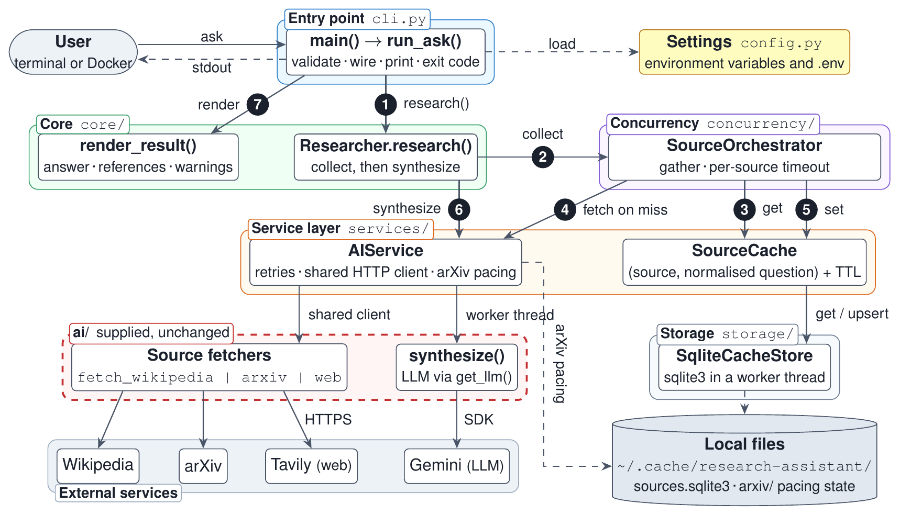

# Architecture



*One `python -m researcher ask` invocation. Solid arrows are calls from caller
to callee, and the circled numbers give their order. Dashed arrows are
configuration, local files or output. Paths in the tabs are relative to
`src/researcher/`.*

| File | Use |
|---|---|
| [`figures/architecture.tex`](figures/architecture.tex) | Editable TikZ source |
| [`figures/architecture.pdf`](figures/architecture.pdf) | Vector figure for the LaTeX report and slides, for example `\includegraphics[width=\linewidth]{architecture.pdf}` |
| [`figures/architecture.png`](figures/architecture.png) | 300 dpi image for Markdown |

## Layers and responsibilities

| Layer | Code | Owns | Leaves to others |
|---|---|---|---|
| Entry point | `cli.py` | Arguments, question and source validation, building the components, printing, exit codes | Research logic |
| Configuration | `config.py` | Validated settings from environment variables and `.env` | |
| Core logic | `core/researcher.py` | Collecting, then synthesizing; turning missing evidence or a failed synthesis into warnings; `render_result()` | Concurrency, retries |
| Concurrency | `concurrency/orchestrator.py` | Running the selected sources together, one deadline per source, the cache-read → fetch → cache-write order, partial failures, URL de-duplication | Retry policy, storage format |
| Service layer | `services/ai_service.py`, `services/arxiv_limit.py` | Calls into `ai/`, bounded retries, the shared HTTP client, arXiv pacing, synthesis in a worker thread | Deadlines |
| | `services/cache.py` | Cache keys (`normalize_query`) and TTL expiry | Persistence |
| Storage | `storage/cache_store.py` | Reading and writing `CacheEntry` rows in SQLite | Key normalisation, expiry |
| Supplied package | `ai/` (unchanged) | Provider calls to Wikipedia, arXiv, web search and the LLM; the `Source` and `AnswerWithCitations` schemas | |
| Shared contracts | `interfaces.py`, `models.py` | `Protocol` interfaces between components; Pydantic models that cross them | |

## One request

1. `main()` loads `Settings`, validates the question and `--sources`, and calls
   `run_ask()`. `run_ask()` builds the store (`SqliteCacheStore`, or an unused
   `InMemoryCacheStore` for `--no-cache`), `SourceCache`, `AIService`,
   `SourceOrchestrator` and `Researcher`, then calls `Researcher.research()`.
2. `Researcher` asks `SourceOrchestrator.collect_sources()` for evidence.
3. For every selected source, concurrently and inside one `asyncio.timeout`,
   the orchestrator calls `SourceCache.get_sources()`. The cache normalises the
   question, reads the `(source, key)` row and treats an expired entry as a
   miss.
4. On a miss, the orchestrator calls `AIService.fetch_sources()`. It calls
   `ai.fetch_wikipedia`, `ai.fetch_arxiv` or `ai.fetch_web` with one shared
   `httpx.AsyncClient`, whose transport retries 408, 429 and 5xx responses,
   honours `Retry-After`, and spaces arXiv requests using lock and timestamp
   files under `~/.cache/research-assistant/arxiv/`.
5. A successful result, including an empty one, is saved with
   `SourceCache.set_sources()`. Failures and timeouts are not saved. A cache
   read or write error becomes a warning, and fetched evidence is kept.
6. If any evidence was collected, `Researcher` calls
   `AIService.synthesize_answer()`. It runs `ai.synthesize` in a worker thread
   with the same retry policy. Answers are never cached.
7. `run_ask()` closes the store, prints `render_result()`, and exits with 0 when
   an answer was produced, otherwise 1. Invalid input or configuration exits
   with 2 before any source is contacted.

On a repeated question, step 3 returns stored evidence, so steps 4 and 5 are
skipped for that source while step 6 still runs. With `--no-cache`, steps 3 and
5 are skipped and the SQLite file is never opened.

## Concurrency model

Each invocation runs one asyncio event loop.

- `asyncio.gather` runs the unique selected sources together. At most three
  tasks run for a question; that is the concurrency bound, and there is no
  separate semaphore.
- `PER_SOURCE_TIMEOUT_SECONDS` limits each source as a whole: cache read, fetch
  attempts, retry waits, arXiv pacing and cache write. One slow or failing
  source does not discard the others.
- Blocking work leaves the event loop: SQLite calls and `ai.synthesize` run
  through `asyncio.to_thread`.
- arXiv requests are serialised across processes that share the same cache
  directory.
- Synthesis has no deadline of its own; its attempts are bounded by the retry
  settings.

## Boundary crossings

**Into `ai/`.** Only `AIService` calls the supplied functions (`ai.fetch_*`,
`ai.synthesize`). Other modules import only the `Source` and
`AnswerWithCitations` schemas. The shared HTTP client crosses the boundary in
the other direction as the `client=` argument, so the supplied fetchers send
their requests through the project's retrying transport. The DuckDuckGo
provider is the exception: its library makes its own requests.

**Into storage.** Only `SourceCache` uses the store, and only through
`CacheStoreProtocol` (`get_entry`, `upsert_entry`, `close`). `SqliteCacheStore`
is the only code that runs SQL; `run_ask()` decides which store to build.

**Swapping providers.** `LLM_PROVIDER` and `WEB_SEARCH_PROVIDER` select
providers inside `ai/`, and no file under `src/researcher/` names a provider.
Moving from Gemini to OpenAI or Anthropic changes `.env` and adds that SDK to
`pyproject.toml` and `uv.lock`, without editing application code. Cached
evidence is not tied to a provider, so clear the cache after changing the
web-search provider (see [invalidation](caching.md#invalidation)).

## Composition and contracts

Components receive their collaborators through constructors, and `run_ask()`
is the only place that wires the concrete classes:

```python
ai_service = AIService(settings)
cache = SourceCache(store, settings.cache_ttl_seconds)
orchestrator = SourceOrchestrator(settings, ai_service, cache)
researcher = Researcher(orchestrator, ai_service)
result = await researcher.research(question, sources, use_cache=use_cache)
```

The constructor parameters are typed with the `Protocol` classes in
`interfaces.py`, so tests supply fakes without inheritance, for example the
fake cache in `tests/test_orchestrator.py`. Composition fits because the parts
vary independently: two stores behind one cache, simulated services in tests,
and real providers in production. Inheritance is limited to framework types:
Pydantic models and settings, exceptions such as `CacheStoreError`, and
`RetryingTransport`, which extends `httpx.AsyncBaseTransport`.

## Data passed between layers

A question (`str`) and `list[SourceName]` → per source, `list[ai.Source]`
(`None` from the cache means a miss) → `SourceOutcome` (status `ok`, `empty`,
`failed` or `timeout`, `cache_hit`, warning) → `CollectionResult` (outcomes,
de-duplicated sources, elapsed time) → `ai.AnswerWithCitations` →
`ResearchResult` → rendered text. The cache stores `CacheEntry` objects
(source, normalised key, sources, `created_at`, `expires_at`). Application
models reject unknown fields.

## Not part of the runtime

There is no HTTP server, web UI, database server, embedding pipeline or
semaphore. `benchmarks/`, `demo_ai.py` and the tests exercise the same
components but are not on the request path. The Docker runtime image runs the
same CLI; a volume mounted at `/home/appuser/.cache/research-assistant` keeps
both the SQLite cache and the arXiv pacing files (see [Docker](docker.md)).

## Updating the figure

Edit `figures/architecture.tex`, then rebuild both exports from the project
root. Build in a temporary folder so LaTeX's `.aux` and `.log` files never
enter the repository:

```bash
mkdir -p /tmp/arch-build
pdflatex -interaction=nonstopmode -output-directory=/tmp/arch-build docs/figures/architecture.tex
cp /tmp/arch-build/architecture.pdf docs/figures/architecture.pdf
pdftoppm -png -r 300 -singlefile docs/figures/architecture.pdf docs/figures/architecture
```

Without a local TeX installation, compile the file on Overleaf with pdfLaTeX,
download the PDF, and export a 300 dpi PNG. Update this page whenever
components or calls change.
